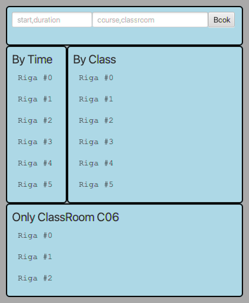
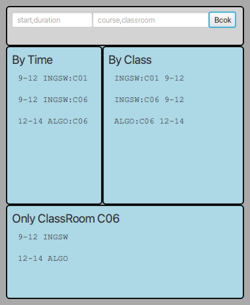
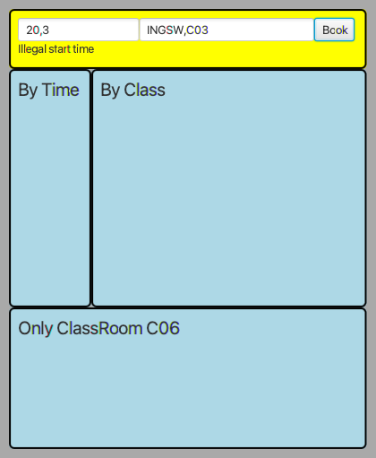
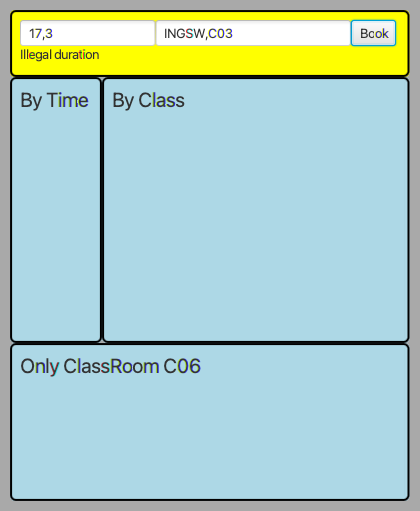
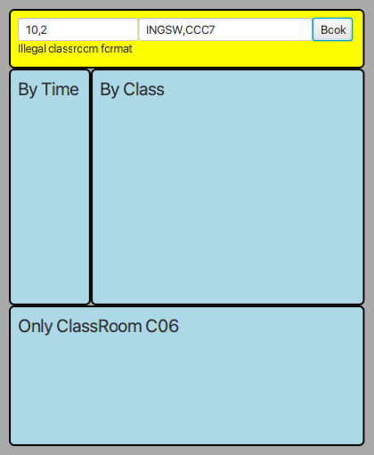

# CORSO INGEGNERIA DEL SOFTWARE A.A. 2023/24
## PRENOTAZIONE AULE ESAME

Obiettivo dell'esercizio è progettare e realizzare un insieme di classi atte a
produrre un semplice programma Java che si occupi di raccogliere e mostrare le 
prenotazioni delle aule per gli esami di una determinata giornata.

Le aule sono prenotabili solo tra le 9 e le 19 e per intervalli al massimo di 4 ore.

Le classi sono identificate tramite un codice composto da una lettera maiuscola 
seguita da due numeri (p.es. `C06`).

I nomi dei corsi non possono essere vuoti, ma non hanno altri vincoli.

Vengono già fornite due *Viste* del sistema:

- [`InputBooking`](src/main/java/it/unimi/di/sweng/esame/view/InputBooking.java):
  permette di immettere una prenotazione con un'ora di partenza, una durata, un nome del corso, e un codice aula. Il formato di inserimento prevede: nel primo campo l'ora di partenza seguita, dopo una 'virgola' (`,`), dal numero di ore della prenotazione; nel secondo campo il nome del corso seguito, dopo una 'virgola' (`,`), dal codice della classe.
- [`DisplayView`](src/main/java/it/unimi/di/sweng/esame/view/DisplayView.java):
  permette di visualizzare un elenco di righe di testo.

Viene fornita anche una prima versione della classe  [`Main`](src/main/java/it/unimi/di/sweng/esame/Main.java) che
permette d'istanziare la parte statica delle viste, e di una
interfaccia [`InputPresenter`](src/main/java/it/unimi/di/sweng/esame/presenter/InputPresenter.java).

**TUTTE LE CLASSI DATE POSSONO ESSERE DA VOI MODIFICATE (CANCELLATE, COMPLETATE) PER ADERIRE A VOSTRE IDEE DI
PROGETTAZIONE MIGLIORATIVE**

Lanciando il programma (tramite il *task* `run` di gradle) si ottiene una interfaccia simile a quella nella figura
sottostante:

## TRACCIA

Completare, in modo da realizzare un'organizzazione del sistema di tipo
*Model-View-Presenter*, aggiungendo le classi necessarie in modo che,
all'immissione di una nuova richiesta di prenotazione, le viste si aggiornino coerentemente:

- La vista "By Time" deve mostrare le prime 6 prenotazioni ordinate per ora di partenza e (in caso di parità) di ora di fine. Il formato di stampa deve indicare l'ora di partenza e l'ora di fine seguiti da nome del corso e codice aula.
- La vista "By Class" deve mostrare le prime 6 prenotazioni ordinate per codice della classe (in caso di parità potete scegliere a piacere). Il formato di stampa deve indicare nome del corso e codice aula seguiti dall'ora di partenza e l'ora di fine.
- La vista "Only ClassRoom C06" deve mostrare le prime 3 prenotazioni ordinate per ora di partenza relative alla classe di codice `C06`. Il formato di stampa deve indicare l'ora di partenza e l'ora di fine seguiti dal solo nome del corso.

### Esempio di esecuzione

Ad esempio se vengono inserite le seguenti prenotazioni (in qualunque ordine):
- "9,3" e "INGSW,C01"
- "9,3" e "INGSW,C06"
- "12,2" e "ALGO,C06"

la situazione mostrata dovrebbe essere

### Gestione input errati

Nel caso in cui l'utente inserisca un input non valido (ad esempio un'ora di inizio o una durata non possibile o 
un codice aula non ammissibile o vuoto) l'interfaccia deve presentare una segnalazione di errore opportuna 

Ad esempio:

### Processo

Una volta effettuato il **clone** del repository, si completa l'implementazione seguendo la *metodologia TDD*;
in maggior dettaglio, ripetendo i passi seguenti fino ad aver implementato tutte le funzionalità richieste. L'implementatore:

* scelta la prossima funzionalità richiesta da implementare, inizia una feature di gitflow
* implementa un test per la funzionalità,
* verifica che **il codice compili correttamente**, ma l'**esecuzione del test fallisca**; solo a questo punto effettua
  un *commit*
  (usando `IntelliJ` o `git add` e `git commit`) iniziando il messaggio di commit con la stringa `ROSSO:`,
* aggiunge la minima implementazione necessaria a realizzare la funzionalità, in modo che **il test esegua con
  successo**; solo a questo punto
  effettua un *commit* (usando `IntelliJ` o `git add` e `git commit`) iniziando il messaggio di commit con la
  stringa `VERDE:`,
* procede, se necessario, al **refactoring** del codice, accertandosi che le modifiche non
  comportino il fallimento di alcun test; solo in questo caso fa seguire a ogni
  passo un *commit* (usando `IntelliJ` o `git add` e `git commit`)
  iniziando il messaggio di commit con la stringa `REFACTORING:`,
* ripete i passi precedenti fino a quando non considera la funzionalità realizzata nel suo complesso e allora chiude la
  feature di gitflow
* effettua un *push* dei passi svolti su `gitlab.di.unimi.it` con `IntelliJ` o`git push --all`.

### Testing

Mano a mano che si sviluppa il progetto, si deve controllare di mantenere una copertura soddisfacente, sia dei comandi che delle
decisioni, soprattutto per il codice rilasciato all'utente (se inferiore al 100% inserire un commento che spieghi perché non è possibile raggiungerlo), cioè consegnato per la valutazione.

Il codice fornito prevede anche una infrastruttura già pronta per eventuali test di integrazione, che può essere usata per definire alcuni test end-to-end. Il suo uso è fortemente consigliato.

### Consegna

Al termine del laboratorio si deve impacchettare l'**ultima versione stabile** come
una _release_ di gitflow chiamata `consegna` (usare esattamente questo nome) ed
effettuare un ultimo *push* di tutti i rami locali (**comprese eventuali _feature_
aperte ma non completate**); si ricordi anche che per i tag occorre un *push*
esplicito (`git push --tags`).

## **Verificare su `gitlab.di.unimi.it`** che ci sia la completa traccia dei *commit* effettuati nei vari *branch* e che ci siano anche i *tag* e di _averne dato visibilità ai docenti_. 
